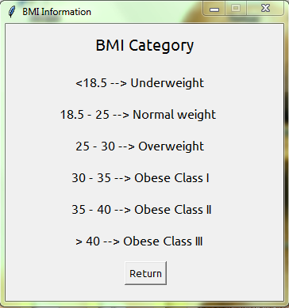

# BMI-Calc
So, I made this BMI Calculator in one day for fun (btw I'm a beginner in Tkinter). If you could comment it, it'd mean so much to me! &lt;3

## Main page

- This was made only by using Python library called *Tkinter!* 

- It also has an info button that opens another *Info* page:

